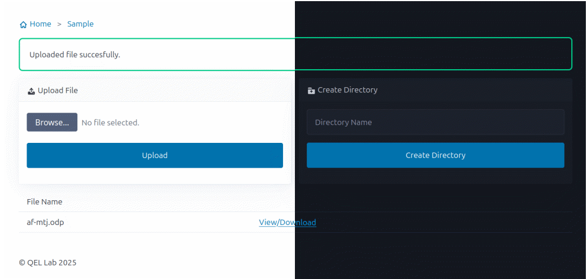

# fileupload

Upload and download files over intranet with a web interface.
FTP/SFTP clients might not be installed on all machines, and logging into online services like google or office is inconvinient.
This simple application helps to transfer and upload files to your own computer from a browser from anywhere in the local network.




## Installation

This application depends on `flask` package. 
Install the package using 

```
conda install flask
```

to install the package in the anaconda environment or use 

```
pip install flask
```

to install the package in local environment.

## Usage

1. Start the server

```
python main.py
```

Navigate to the ip address of your computer on port number 5000 to start using the application. 
For example if your IP address is 10.33.20.152, navigate to `http://10.33.20.152:5000` from a browser.
All the contents in the `uploads` folder will be visible. 
You can find all the uploaded files in the same folder.
For safety reasons, no delete function is implemented.
